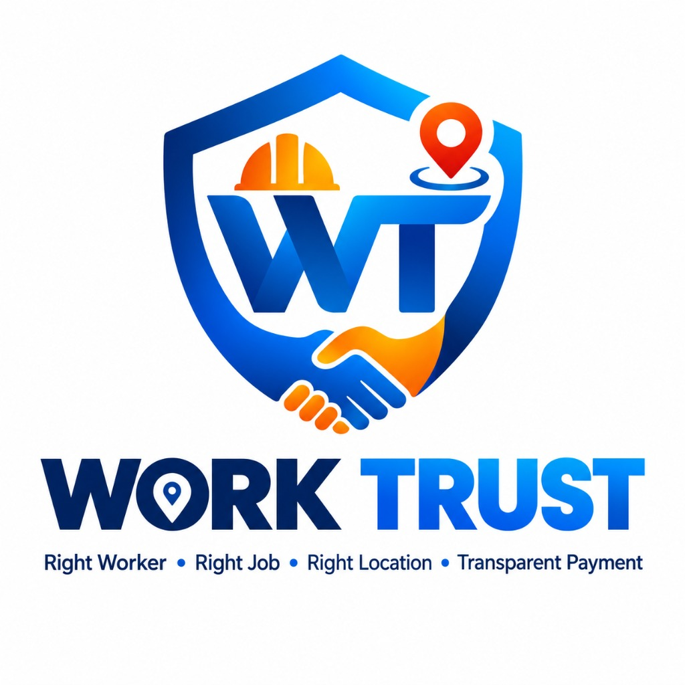

<p align="center">
  
</p>

<h1 align="center">WORK TRUST</h1>

<p align="center">
  <strong>Cooperative Gig Services Platform for Household & Community Services</strong><br>
  <em>Right Worker • Right Job • Right Location • Transparent Payment</em>
</p>

<p align="center">
  
  
  
  
  
</p>

---

## 📌 Problem Statement Overview

- **Hackathon**: Smart India Hackathon (SIH) 2026
- **Problem Statement ID**: **26089**
- **Title**: *Cooperative Gig Services platform for household & community services*
- **Theme**: *Agriculture, Foodtech & Rural Development*

### The Informal Workforce Crisis in India
Informal gig workers in India face severe structural vulnerabilities:
1. **Irregular Employment**: Work is erratic, volatile, and dependent on localized word-of-mouth.
2. **Unfair Wages & Hidden Cuts**: Conventional gig aggregators siphon 20% to 35% in opaque commissions.
3. **Time & Transit Wastage**: Workers spend hours traveling across long distances without travel compensation.
4. **Lack of Safety & Welfare**: Zero insurance, no emergency safety nets, and no institutional credibility.

---

## 💡 The Work Trust Solution

**Work Trust** transforms informal labor by organizing individual workers into self-governing **Worker Cooperatives & Teams**, powered by an **Explainable AI Matching Engine** and a **Transparent Wage-Splitting Architecture**.

```
                           +---------------------------+
                           |        WORK TRUST         |
                           |   Full-Stack Platform     |
                           +-------------+-------------+
                                         |
      +--------------------+-------------+-------------+--------------------+
      |                    |                           |                    |
      v                    v                           v                    v
+---------------+  +---------------+           +---------------+  +---------------+
|     🪪        |  |      🤝       |           |      🧠       |  |      🛡️       |
| Skill         |  | Group         |           | Explainable   |  | Welfare &     |
| Passport      |  | Hiring        |           | AI Matching   |  | Safety Shield |
+---------------+  +---------------+           +---------------+  +---------------+
```

### The 4 Innovation Pillars

| Pillar | Description |
|---|---|
| 🪪 **Skill Passport** | Verifiable digital credentials, certified trade experience, NSDC badges, and real-time reliability ratings (0–100%). |
| 🤝 **Group Hiring** | Enables customers to book 2 to 10+ worker teams for agricultural harvesting, community sanitation, and complex repairs with dynamic cooperative roster allocation. |
| 🧠 **Explainable AI Matching** | Deterministic multi-factor candidate scoring with transparent audit reasons (Skills 30%, Availability 15%, Distance 15%, Reliability 15%, Experience 10%, Rating 5%, Verification 5%, Wage 5%). |
| 🛡️ **Welfare & Safety Shield** | Built-in micro-insurance status, platform welfare contributions, on-site emergency SOS, and hazard escalation workflows. |

---

## 🏗️ System Architecture

```
               +--------------------------------------------+
               |         Clients: Mobile & Web Apps         |
               | (Worker App, Customer App, Admin Dashboard)|
               +---------------------+----------------------+
                                     |
                                     | REST JSON / JWT
                                     v
               +--------------------------------------------+
               |          Work Trust API Gateway            |
               |         (Express.js + TypeScript)          |
               +---------------------+----------------------+
                                     |
         +---------------------------+---------------------------+
         |                           |                           |
         v                           v                           v
+------------------+       +------------------+       +------------------+
| AI Matching &    |       | Job State        |       | Transparent Wage |
| Reliability      |       | Machine & OTP    |       | Split & Payment  |
| Engine           |       | Attendance       |       | Service          |
+------------------+       +------------------+       +------------------+
         |                           |                           |
         +---------------------------+---------------------------+
                                     |
                                     v
               +--------------------------------------------+
               |           Relational Persistence           |
               |     SQLite (Dev) / PostgreSQL (Prod)       |
               |         27 Normalized Tables (Knex)        |
               +--------------------------------------------+
```

---

## 🛠️ Technology Stack

| Layer | Technologies |
|---|---|
| **Backend REST API** | Node.js (v18+ / v25+), TypeScript, Express.js, Winston, Helmet, CORS |
| **Database & ORM** | Knex.js, SQLite (Dev zero-native dependencies), PostgreSQL 15+ & PostGIS (Prod) |
| **Authentication** | JWT (Access + Rotating Refresh Tokens), bcryptjs, Role-Based Access Control (RBAC) |
| **AI Matching Engine** | Multi-factor weighted candidate scoring, Haversine spatial calculation |
| **Admin Web Portal** | React 19, Vite, Tailwind CSS, Recharts, TanStack Query |
| **Mobile Application** | React Native, Expo (Expo Router), Zustand, React Native Paper |
| **Testing Suite** | Jest, ts-jest, Supertest |
| **DevOps & Cloud** | Docker, Docker Compose, Render (`render.yaml`), GitHub Actions CI/CD |

---

## 👥 Pre-Seeded Demo Accounts

All credentials work out of the box with the pre-seeded dataset:

| Role | Email | Password | Persona |
|---|---|---|---|
| **Admin** | `admin@nexvion.demo` | `NexvionDemo@2026` | Platform Governance Officer (verification, demand analytics, dispute tickets) |
| **Customer** | `customer@nexvion.demo` | `Demo@12345` | Ananya Sharma (Community secretary posting a 4-worker group gig) |
| **Worker** | `worker@nexvion.demo` | `Demo@12345` | Rahul Kumar (Verified Master Electrician, Skill Passport verified) |
| **Cooperative** | `cooperative@nexvion.demo` | `Demo@12345` | Sunil Patil (Leader, Team Alpha - Electrical & Repair Collective) |

*(Additional pre-seeded accounts: `customer1`–`customer10@nexvion.demo`, `worker1`–`worker20@nexvion.demo`, `coop1`–`coop5@nexvion.demo` with password `Demo@12345`)*

---

## 💰 Transparent Wage Splitting Formula

Work Trust eliminates hidden aggregator commissions. For every job with budget $B$:

$$\text{Platform Safety Fee: } F_{\text{platform}} = B \times 10\%$$
$$\text{Cooperative Welfare Fund: } C_{\text{coop}} = (B - F_{\text{platform}}) \times 10\%$$
$$\text{Total Worker Wages: } W_{\text{total}} = B - F_{\text{platform}} - C_{\text{coop}}$$
$$\text{Per Worker Payout: } W_i = \frac{W_{\text{total}}}{N} \quad (\text{for } N \text{ workers})$$

### Example for a ₹5,000 Group Job (4 Workers):
- 👷 **Worker 1 (Rahul Kumar)**: ₹1,013
- 👷 **Worker 2 (Amit Verma)**: ₹1,013
- 👷 **Worker 3 (Suresh Shinde)**: ₹1,012
- 👷 **Worker 4 (Pooja Nair)**: ₹1,012
- 🤝 **Cooperative Welfare & Equipment Fund (10%)**: ₹450
- 🛡️ **Work Trust Platform Safety Shield (10%)**: ₹500
- **Total**: **₹5,000** *(100% transparently accounted for)*

---

## ⚡ Quick Start Guide

### 1. Clone the Repository
```bash
git clone https://github.com/arjun60840-stack/turst-work.git
cd turst-work
```

### 2. Backend Setup & Startup
```bash
cd apps/backend
npm install
npx knex migrate:latest
npx knex seed:run
npm run dev
```
- API Base URL: `http://localhost:3000/api`
- Health Check: `http://localhost:3000/api/health`

### 3. Run Automated Tests
```bash
cd apps/backend
npm test -- --forceExit
```
Runs 5 Jest test suites (Matching, Reliability, Wage Split, State Machine, and the complete 9-step End-to-End demonstration scenario).

### 4. Admin Web Portal
```bash
cd apps/admin
npm install
npm run dev
```
Portal available at `http://localhost:5173`.

### 5. Mobile Application Preview
```bash
cd apps/mobile
npm install
npx expo start --web
```

---

## 🧪 Test Suite Results (100% Passing)

```
PASS tests/wage-split.test.ts
PASS tests/reliability.test.ts
PASS tests/job-state.test.ts
PASS tests/matching.test.ts
PASS tests/e2e-demo.test.ts
  Work Trust SIH 2026 End-to-End Demonstration Scenario
    ✓ Step 1: Customer creates a Group Hiring Job Request (4 workers) (47 ms)
    ✓ Step 2: AI Matching Engine executes candidate filtering, scoring, and explanation (88 ms)
    ✓ Step 3: Customer books the recommended team and accepts Digital Agreement (40 ms)
    ✓ Step 4: Customer generates OTP for on-site attendance (13 ms)
    ✓ Step 5: Worker/Team enters OTP + GPS to verify attendance and start job (142 ms)
    ✓ Step 6: Job marked completed and transparent wage split is verified (32 ms)
    ✓ Step 7: Demo payment processed and line-item transaction recorded (48 ms)
    ✓ Step 8: Customer submits review and ratings are persisted (34 ms)
    ✓ Step 9: Admin dashboard KPI reflects active jobs and transactions (97 ms)

Test Suites: 5 passed, 5 total
Tests:       20 passed, 20 total
Snapshots:   0 total
Time:        4.072 s
```

---

## 🎯 10-Minute Live SIH Demonstration Flow

1. **Customer Login**: Sign in as `customer@nexvion.demo` (`Demo@12345`).
2. **Create Group Gig**: Select **Electrical**, toggle **Group Hiring**, request **4 workers**, budget **₹5,000**.
3. **AI Smart Matching**: System computes multi-factor score $\rightarrow$ displays **Team Alpha (95% Match)** with explainable audit reasons (*skills matched, capacity verified, 2.8 km away, verified team, 95% reliability*).
4. **Digital Job Agreement**: Customer confirms terms with upfront financial split.
5. **On-Site Attendance**: Customer presents Demo OTP `123456`. Worker logs in as `worker@nexvion.demo`, enters OTP + GPS coordinates $\rightarrow$ job status advances to `IN_PROGRESS`.
6. **Completion & Transparent Split**: Job completed $\rightarrow$ transparent line-item wage split displayed $\rightarrow$ Demo payment processed.
7. **Dual Review**: 5-star rating submitted $\rightarrow$ reliability and ratings updated in real time.
8. **Admin Portal**: Sign in as `admin@nexvion.demo` at `http://localhost:5173` to view live transaction KPIs, verify Skill Passports, and inspect demand forecasting trends.

---

## 📚 In-Depth Documentation

- [Architecture Specification](docs/architecture.md)
- [Database Schema Reference (27 Tables)](docs/database.md)
- [REST API Specification](docs/api.md)
- [Explainable AI & Reliability Engine](docs/ai.md)
- [SIH Master Demonstration Guide](docs/demo.md)
- [Security Hardening Guide](docs/security.md)
- [Operational Troubleshooting](docs/troubleshooting.md)
- [Production Deployment Guide](DEPLOYMENT.md)

---

<p align="center">
  Built with ❤️ for <strong>Smart India Hackathon 2026</strong> • Problem Statement 26089
</p>
